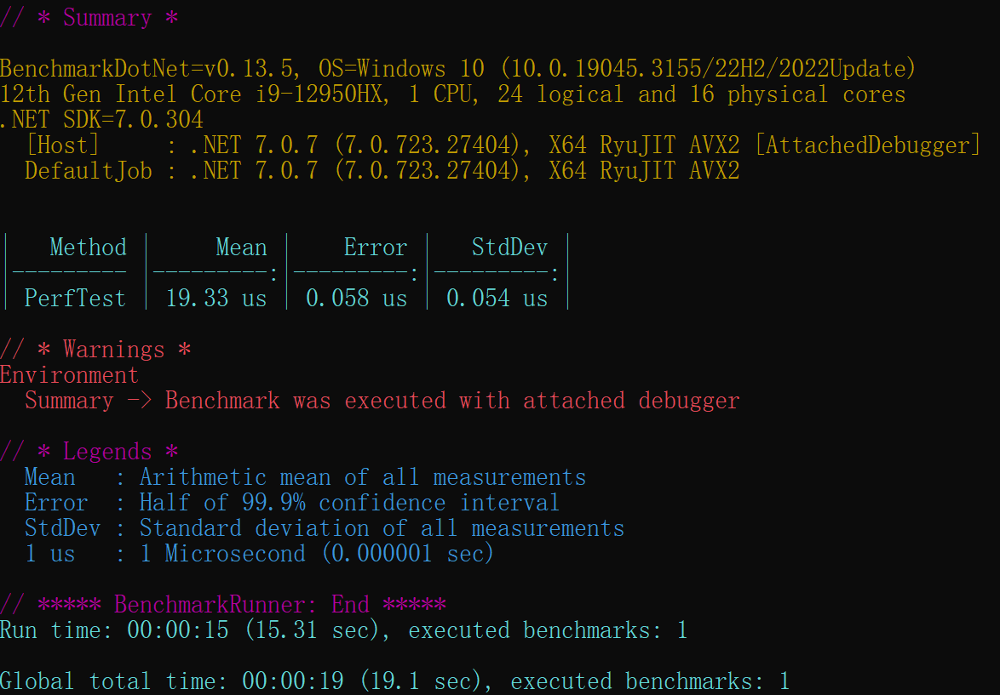

# VSOP87.NET 

[](https://www.nuget.org/packages/VSOP87.NET/)
[](https://www.nuget.org/packages/VSOP87.NET/)

## What's this?

VSOP was developed and is maintained (updated with the latest data) by the scientists at the Bureau des Longitudes in Paris. 

VSOP87, computed the positions of the planets directly at any moment, as well as their orbital elements with improved accuracy.

Original VSOP87 Solution was write by FORTRAN 77 . It's too old to use. 

This repo is not just programming language translation, it's refactoring of VSOP87.

## Features

1. Use VSOPResult class to manage calculate results.
2. Use VSOPTime class to manage time. 
</br>Easy to convert time by calling ```VSOPTime.UTC```, ```VSOPTime.TAI```, ```VSOPTime.TDB```

3. Very high performance per solution using multithread.


4. Useful Utility class. Such as checking planet available in specific version.
5. Async Api 
6. Use [MessagePack](https://github.com/neuecc/MessagePack-CSharp) for binary serialize.
<br>Initialization time becomes less than 10% of previous.
7. Brotli compression on source data. ~34Mb -> ~3MB with no data lost.
<br>

## How to use

* NuGet Package Manager
    ```
    PM> NuGet\Install-Package VSOP87.NET -Version 1.1.6
    ```

```csharp
using System.Text.Json;
using VSOP87;

Calculator vsop = new Calculator();

// ── 1. Create VSOPTime (UTC input, auto-converts to TDB internally) ──────────
VSOPTime vTime = new VSOPTime(DateTime.UtcNow, TimeFrame.UTC);

// ── 2. Basic usage: VSOP87D → spherical (LBR) heliocentric, ecliptic of date ─
VSOPResult_LBR lbr = (VSOPResult_LBR)vsop.GetPlanetPosition(VSOPBody.EARTH, VSOPVersion.VSOP87D, vTime);

Console.WriteLine($"Body:              {lbr.Body}");
Console.WriteLine($"Coordinates Type:  {lbr.CoordinatesType}");
Console.WriteLine($"Frame:             {lbr.FrameType}");
Console.WriteLine($"Epoch:             {lbr.Epoch}");
Console.WriteLine($"Time UTC:          {lbr.Time.UTC:o}");
Console.WriteLine($"Time TDB:          {lbr.Time.TDB:o}");
Console.WriteLine("---------------------------------------------------------------");
Console.WriteLine(String.Format("{0,-33}{1,30}", "longitude (rad)",             lbr.l));
Console.WriteLine(String.Format("{0,-33}{1,30}", "latitude (rad)",              lbr.b));
Console.WriteLine(String.Format("{0,-33}{1,30}", "radius (au)",                 lbr.r));
Console.WriteLine(String.Format("{0,-33}{1,30}", "longitude velocity (rad/day)", lbr.dl));
Console.WriteLine(String.Format("{0,-33}{1,30}", "latitude velocity (rad/day)",  lbr.db));
Console.WriteLine(String.Format("{0,-33}{1,30}", "radius velocity (au/day)",     lbr.dr));
Console.WriteLine("===============================================================");

// ── 3. Coordinate-type conversions (frame & epoch are preserved) ─────────────
VSOPResult_XYZ xyz = lbr.ToXYZ();   // spherical → cartesian
VSOPResult_ELL ell = lbr.ToELL();   // spherical → elliptic elements

// ── 4. Epoch conversion: ecliptic of date → fixed J2000 ──────────────────────
VSOPResult_LBR lbr_j2000 = (VSOPResult_LBR)lbr.ChangeEpoch(Epoch.J2000);

// ── 5. Frame conversion: Dynamical → ICRS equatorial ─────────────────────────
//    (Calculator instance is required for Barycentric conversions)
VSOPResult_LBR lbr_icrs = (VSOPResult_LBR)lbr.ChangeFrame(FrameType.ICRS, vsop);

// ── 6. VSOP87A → cartesian (XYZ) heliocentric, dynamical J2000 ───────────────
VSOPResult_XYZ xyz_a = (VSOPResult_XYZ)vsop.GetPlanetPosition(VSOPBody.EARTH, VSOPVersion.VSOP87A, vTime);

// Convert to barycentric (requires VSOP87E Sun data internally)
VSOPResult_XYZ xyz_bary = (VSOPResult_XYZ)xyz_a.ChangeFrame(FrameType.Barycentric, vsop);

// ── 7. VSOP87 → elliptic orbital elements ────────────────────────────────────
VSOPResult_ELL ell_emb = (VSOPResult_ELL)vsop.GetPlanetPosition(VSOPBody.EMB, VSOPVersion.VSOP87, vTime);

Console.WriteLine(String.Format("{0,-33}{1,30}", "semi-major axis (au)",          ell_emb.a));
Console.WriteLine(String.Format("{0,-33}{1,30}", "mean longitude (rad)",           ell_emb.l));
Console.WriteLine(String.Format("{0,-33}{1,30}", "k = e*cos(pi)",                  ell_emb.k));
Console.WriteLine(String.Format("{0,-33}{1,30}", "h = e*sin(pi)",                  ell_emb.h));
Console.WriteLine(String.Format("{0,-33}{1,30}", "q = sin(i/2)*cos(omega)",        ell_emb.q));
Console.WriteLine(String.Format("{0,-33}{1,30}", "p = sin(i/2)*sin(omega)",        ell_emb.p));

// ── 8. Async API ──────────────────────────────────────────────────────────────
VSOPResult result = await vsop.GetPlanetPositionAsync(VSOPBody.JUPITER, VSOPVersion.VSOP87B, vTime);

// ── 9. JSON serialization (System.Text.Json, polymorphic) ────────────────────
string json = JsonSerializer.Serialize(lbr, new JsonSerializerOptions { WriteIndented = true });
Console.WriteLine(json);
```

# Change Log
### v2.0.0 2026.03.24
Major Refactor 

### v1.2.1 2024.09.19

Upgrade dependency FastLZMA2 = 1.0.0

### v1.2.0 2024.08.10
**Beaking Change Warning**

migrate serializer to memorypack.

migrate data compress algorithm to FastLZMA2.

performance improvement.

.NET6&7 end of support.

### v1.1.7 2024.01.14 

Critical Bug fix.

### V1.1.6 2023.07.07

Bug fix.

### V1.1.5 2023.07.06

Inpired from vsop2013, Add `dynamical equinox and ecliptic` to `ICRS frame` conversion.

Use MessagePack and brotli to compress original data.

Some bug fix. 

### V1.1.2 2023.07.05

Bug fix

Add ```VSOPTime.JulianDate``` property

Delete float version. It's useful and nosense.

Add ELL coord to XYZ coord conversion.

Add ELL coord to LBR coord conversion.

add XYZ coord to LBR coord conversion

add LBR coord to XYZ coord conversion

function that convert ELL to XYZ is copy from VSOP2013.

This is a magic function way beyond my math level.

So I can't find how to inverse XYZ elements to ELL elements.

### V1.1.0 2023.07.02  
Bug fix 

Move to .NET7 for better performance.

Add async api

Add performance test framework 
 
<br>

### v1.0.3 2023.03.23

Add float version calculator ```VSOP87.CalculatorF```. 

But no performance Improvement.
 
<br>

### v1.0 2022.06.05

Code Cleaning.

Performance optimization.
 
<br>

### beta 2022.03.12

A lot of new features.

Performance Optimization.
 
<br>

### alpha 2021.12.04 

I make a data converter

Converting text data file into binary serialized file and embed in core DLL

All 6 version solution & All planets supported

Original data and solution download 

 ftp://ftp.imcce.fr/pub/ephem/planets/vsop87/

VSOP87 algorithm remastered in C#

<br>

# About VSOP87.BR

It's a RAM db that 80's would never imaging a computer can hold that huge amout data  

It's loaded into RAM when initiate VSOP calculator class

<br>

# Enviroment 

.NET 8/10 Runtime Windows x64

<br>

